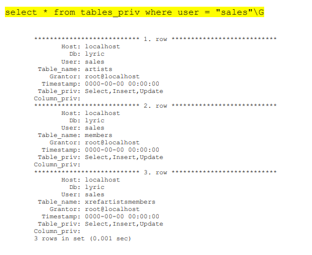
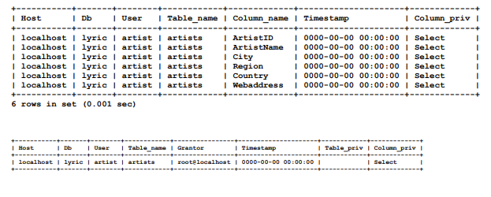
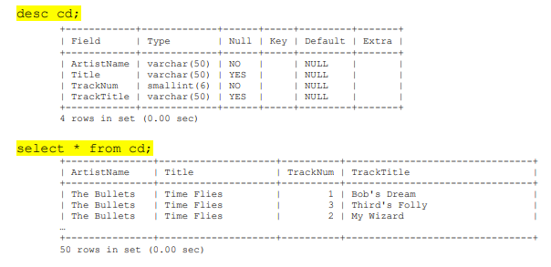
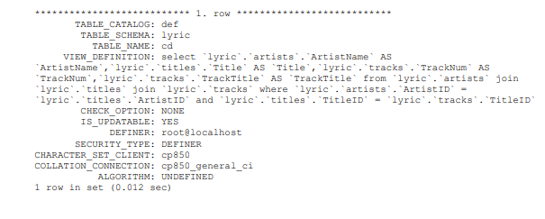
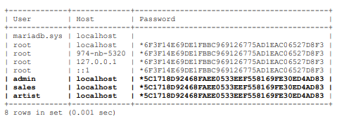

# CS 415 Database Management Systems  
## Lab #3 – Hosting & Security (40 Points)  
**Due:** 12/5/2023 at 11:55 pm

---

## Overview

The purpose of this assignment is to gain experience with **database security**, including:

- Creating users  
- Creating views  
- Granting privileges at the database, table, and column levels  

You will use **MariaDB Community Edition** installed locally. You may use your laptop, desktop, or a Raspberry Pi (available in S162 lab).

Commands should be run from the MariaDB command prompt.

Download MariaDB:  
https://mariadb.com/downloads/community/community-server/

---

## Create the `lyric` Database

```sql
create database lyric;
use lyric;
source c:\users\smith\Downloads\createLyric.sql;
````

> **Note:** Ensure the filename is not saved as `createLyric.sql.txt`.

---

## Assignment Notes

- You will create three users for your database: admin, sales, and artist
- Each of these users must use `localhost` as the host value.
- Grant statements will often include single quote ie. 'smith'@'localhost'
- You must create a password for each user.
- You may use GRANT or CREATE USER
- While not as critical on your laptop, it is a good idea to set a password for root


The assignment will be graded based on the **data stored in your MariaDB database**.
Students will submit the results of the required queries from parts B, C, D, and E.


**You may be asked to demonstrate MariaDB installation in class with users created
for the assignment.**


---

# Part A — Database Level Privileges (8 points)

### 1. **As root** create admin and grant database-level privileges:

```sql
create user admin@localhost;
grant all on lyric.* to 'admin'@'localhost';
```

### 2. Login as admin and set password:

```bash
mysql -u admin -p
set password = password('pw');
```

### 3. **As root**, show admin's privileges:

```sql
use mysql;
select * from user where user='admin' and host='localhost'\G
select * from db   where user='admin' and host='localhost'\G
```

**Submit:**
Full results of both queries.


---

# Part B — Table Level Privileges (5 points)

### 1. Create sales user and grant table-level privileges:

```sql
create user 'sales'@'localhost' identified by 'pw';

grant select, insert, update on lyric.Artists            to 'sales'@'localhost';
grant select, insert, update on lyric.Members            to 'sales'@'localhost';
grant select, insert, update on lyric.XrefArtistsMembers to 'sales'@'localhost';
```

### 2. Test as sales user:

```bash
mysql -u sales -p
use lyric;

show tables;
select * from artists;

delete from artists;  -- should fail
```

### 3. Show table-level privileges:

```sql
select * from tables_priv where user='sales'\G
```

**Submit:**
Results of the `tables_priv` query.



---

# Part C — Column Level Privileges (8 points)

### 1. Create artist user with column-level privileges:

```sql
create user 'artist'@'localhost';

grant select (ArtistID, ArtistName, City, Region, Country, WebAddress)
on lyric.Artists
to 'artist'@'localhost';
```

### 2. Test as artist:

```bash
mysql -u artist -p
set password = password('pw');
use lyric;

show tables;
desc artists;
select * from artists;             -- should fail
select ArtistName, City from artists;  -- should work
update artists set city="test";    -- should fail
```

### 3. Show metadata for column/table privileges:

```sql
use mysql;

select * from columns_priv where user='artist' and host='localhost';
select * from tables_priv   where user='artist' and host='localhost';
```

**Submit:**
Results of both queries.



---

# Part D — Views (8 points)

### 1. Create view `cd`:

```sql
use lyric;

create view cd as
select
    artists.ArtistName,
    titles.Title,
    tracks.TrackNum,
    tracks.TrackTitle
from Artists, Titles, Tracks
where artists.ArtistID = titles.ArtistID
  and titles.TitleID  = tracks.TitleID;
```

### 2. Test the view:

```sql
desc cd;
select * from cd;
```




### 3. Show view definition:

```sql
use information_schema;
select * from views where table_name='cd'\G
```

**Submit:**
Result of the `views` query.




---

# Part E — Users (8 points)

### Show all users and password hashes:

```sql
use mysql;
select user, host, password from user;
```



---

## What to Upload

As text, Upload to Moodle the SQL results for:

* **Part A** two selects from Part A. #3
* **Part B** select from Part B. #2
* **Part C** two selects from Part C. #3
* **Part D** select from Part D. #3
* **Part E** select from Part E.

You may also be asked to demo your MariaDB installation in class with user accounts created for the assignment.

-- end --
