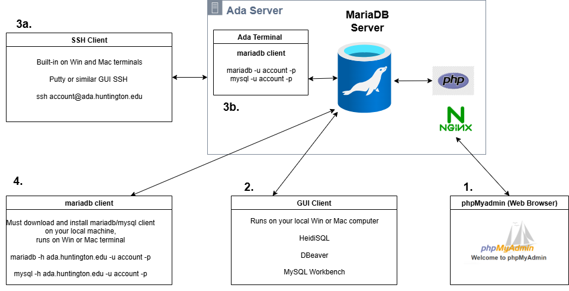

## Connection Options to Ada Database Server

1. Through **web browser**, use **phpMyAdmin** hosted at [ADA server](https://ada.huntington.edu/phpmyadmin/)
phpMyadmin is a PHP application that runs on a web server (NGINX) hosted on Ada and accesses the database server on Ada.

2. Download and install a **GUI web client** such as [HeidiSQL](https://www.heidisql.com/), [DBeaver](https://dbeaver.io/), or [MySQL Workbench](https://www.mysql.com/products/workbench/). The GUI client runs on your local computer and accesses the database server on Ada.

3. **SSH** to ADA and use **mariadb/mysql client directly on server**
- (3a.) Use an **SSH client** running on your local computer to connect to Ada server. SSH is already installed on Windows and Macintosh terminals. Can also use GUI SSH programs like **putty**.
- (3b.)Use the **mariadb/mysql client running on the Ada server** to connect the database server on Ada.

```bash

ssh account@ada.huntington.edu

mariadb -u account -p

mysql -u account -p
```
4. Use the **mariadb/mysql client running on your local machine** to connect directly to the database server on Ada.
```bash
mariadb -h ada.huntington.edu -u account -p
```
5. (not shown) Connect using **coding language** like **Python** or **Java**.

-- end --
