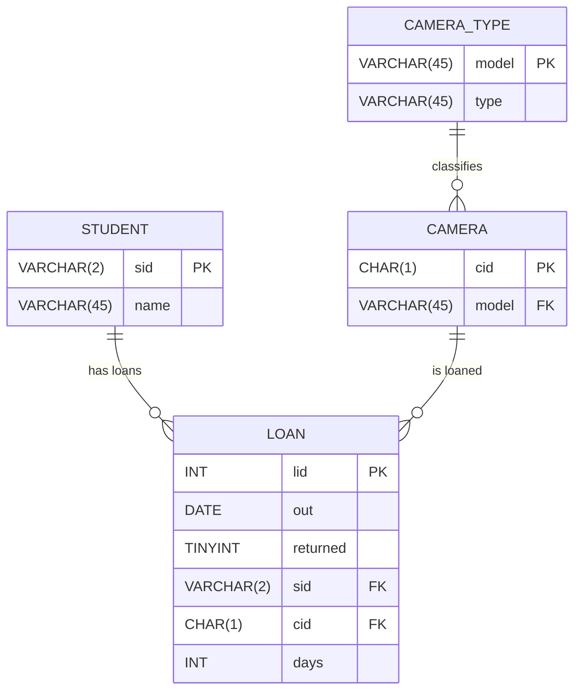

# CS415 Database Sample Project – Fall 2025 - Draft

---

### Database Summary Report (10 points)

* 2 or 3 paragraphs describing the business/organization/person that will use your database.
* 2 or 3 paragraphs describing how the database will be used from a user’s perspective.

---

### Database ER Model (40 points)

* Fully normalized (or provide explanation for denormalization).
* Using `Mermaid` show your ER diagram including MariaDB data types, primary keys, foreign keys,
* relationships (with names), and participation.
* 2 or 3 paragraphs describing the overall design for your database, including any issues or design choices you made as part of the normalization process.
* 2 or 3 sentences each describing the purpose of each table in your database.



---

### Create Tables (20 points)

Create a single SQL code block to create your tables.

* Create **3–5 tables** (more if needed).
* Each table has **3–10 fields**.
* Use **4 or more MariaDB data types**.
* Include **primary keys** and **foreign keys** for each table.
* Include indexes as appropriate.
* Do **not** include a `CREATE DATABASE` statement in your script.

```sql
-- prj1.sql
-- j.l.lehman
-- sample create statements for CS415 database project
-- creates database from exam #3

-- -----------------------------------------------------
-- Table `student`
-- -----------------------------------------------------
CREATE TABLE IF NOT EXISTS `student` (
  `sid` VARCHAR(2) NOT NULL,
  `name` VARCHAR(45) NULL,
  PRIMARY KEY (`sid`))
ENGINE = InnoDB;


-- -----------------------------------------------------
-- Table `camera_type`
-- -----------------------------------------------------
CREATE TABLE IF NOT EXISTS `camera_type` (
  `model` VARCHAR(45) NOT NULL,
  `type` VARCHAR(45) NULL,
  PRIMARY KEY (`model`))
ENGINE = InnoDB;


-- -----------------------------------------------------
-- Table `camera`
-- -----------------------------------------------------
CREATE TABLE IF NOT EXISTS `camera` (
  `cid` CHAR(1) NOT NULL,
  `model` VARCHAR(45) NOT NULL,
  PRIMARY KEY (`cid`),
  CONSTRAINT `fk_camera_camera_detail1`
    FOREIGN KEY (`model`)
    REFERENCES `camera_type` (`model`)
    ON DELETE NO ACTION
    ON UPDATE NO ACTION)
ENGINE = InnoDB;


-- -----------------------------------------------------
-- Table `loan`
-- -----------------------------------------------------
CREATE TABLE IF NOT EXISTS `loan` (
  `lid` INT NOT NULL AUTO_INCREMENT,
  `out` DATE NULL,
  `returned` TINYINT NULL,
  `sid` VARCHAR(2) NOT NULL,
  `cid` CHAR(1) NOT NULL,
  `days` INT NULL,
  PRIMARY KEY (`lid`),
  CONSTRAINT `fk_loan_student`
    FOREIGN KEY (`sid`)
    REFERENCES `student` (`sid`)
    ON DELETE NO ACTION
    ON UPDATE NO ACTION,
  CONSTRAINT `fk_loan_camera1`
    FOREIGN KEY (`cid`)
    REFERENCES `camera` (`cid`)
    ON DELETE NO ACTION
    ON UPDATE NO ACTION)
ENGINE = InnoDB;
```

---

### Insert Data (20 points)

Create a single SQL code block to insert data.

* Insert **20–100 rows per table** (more if needed).
* One of your tables must have 100 rows or more of data.

```sql
-- prj2.sql
-- j.l.lehman
-- sample insert statements for CS415 database project
-- adds sample data from exam #3

-- -----------------------------------------------------
-- Data for table `student`
-- -----------------------------------------------------
INSERT INTO `student` (`sid`, `name`) VALUES ('11', 'Alice');
INSERT INTO `student` (`sid`, `name`) VALUES ('22', 'Bob');
INSERT INTO `student` (`sid`, `name`) VALUES ('33', 'Carol');
INSERT INTO `student` (`sid`, `name`) VALUES ('44', 'Dan');


-- -----------------------------------------------------
-- Data for table `camera_type`
-- -----------------------------------------------------
INSERT INTO `camera_type` (`model`, `type`) VALUES ('Canon 90D', 'SLR');
INSERT INTO `camera_type` (`model`, `type`) VALUES ('Nikon D6', 'SLR');
INSERT INTO `camera_type` (`model`, `type`) VALUES ('Canon M20', 'mirrorless');
INSERT INTO `camera_type` (`model`, `type`) VALUES ('Canon A1', 'film');
INSERT INTO `camera_type` (`model`, `type`) VALUES ('Fujifilm 70', 'instant');


-- -----------------------------------------------------
-- Data for table `camera`
-- -----------------------------------------------------
INSERT INTO `camera` (`cid`, `model`) VALUES ('A', 'Canon 90D');
INSERT INTO `camera` (`cid`, `model`) VALUES ('B', 'Canon 90D');
INSERT INTO `camera` (`cid`, `model`) VALUES ('C', 'Nikon D6');
INSERT INTO `camera` (`cid`, `model`) VALUES ('D', 'Canon M20');
INSERT INTO `camera` (`cid`, `model`) VALUES ('E', 'Canon A1');
INSERT INTO `camera` (`cid`, `model`) VALUES ('F', 'Fujifilm 70');

-- -----------------------------------------------------
-- Data for table `loan`
-- -----------------------------------------------------
INSERT INTO `loan` (`lid`, `out`, `returned`, `sid`, `cid`, `days`) VALUES (1, '2019-10-15', TRUE, '11', 'A', 1);
INSERT INTO `loan` (`lid`, `out`, `returned`, `sid`, `cid`, `days`) VALUES (2, '2019-10-15', TRUE, '33', 'B', 2);
INSERT INTO `loan` (`lid`, `out`, `returned`, `sid`, `cid`, `days`) VALUES (3, '2019-10-16', TRUE, '11', 'C', 3);
INSERT INTO `loan` (`lid`, `out`, `returned`, `sid`, `cid`, `days`) VALUES (4, '2019-10-16', FALSE, '44', 'C', 4);
INSERT INTO `loan` (`lid`, `out`, `returned`, `sid`, `cid`, `days`) VALUES (5, '2019-10-18', TRUE, '22', 'D', 2);
INSERT INTO `loan` (`lid`, `out`, `returned`, `sid`, `cid`, `days`) VALUES (6, '2019-10-20', TRUE, '11', 'E', 7);
INSERT INTO `loan` (`lid`, `out`, `returned`, `sid`, `cid`, `days`) VALUES (7, '2019-10-25', FALSE, '33', 'F', 5);

```

---

### Queries (60 points)

Create ten SQL code blocks that demonstrate the following queries. For each query, include a **2–3 sentence description** before 
the SQL code block explaining its purpose and when/why it would be used.  Clear label each Query ie. Query 1, Query 2, etc...  
Show the results of your queries in table format.  Abbreviate the output for large results.

1. `SELECT` using **ORDER BY** two or more columns.

   Show all students sorted by their last name ...
```sql

select * from student order by name desc;

```

2. `SELECT` using a **calculated field** with a meaningful column heading.
   * Example: `lengthseconds / 60 AS minutes` (not an aggregation).
  
   Show loan length as hours ...
         
```sql

select * from days * 24 as hours from loan;

```
  
3. 
4. `SELECT` using a **MariaDB function** (e.g., `MID`, `MONTH`, `DATE`) (not an aggregation).
5. `SELECT` with an **aggregation** (`COUNT`, `SUM`, `MIN`, `AVG`) plus `GROUP BY` and `HAVING`.
6. `Join` of **three or more tables** (INNER JOIN or cross-product).
7. Left or Right `JOIN` (left, or right join).

8. 9. `UPDATE` query.
10. `DELETE` query.
11. Create a `View` and demonstrate using this view.
12. Create a `Transaction` with either `ROLLBACK` or `COMMIT` and demonstrate this transaction.

---

### Reports (20 points) 

Connect to an external reporting tool (or export your data) and create two reports.

1. Chart or Graph-based report
2. Table-based report with Report Title

Use Excel, Access, PowerBI, or any other reporting tool.  Post your report and include a link to each report as a .pdf (or viewable image). 
In one or two paragraphs, describe the reporting software you used and the purpose of each report.

---

### Delete Tables (10 points)

Create a single SQL code block to delete your tables and data.

* Script to delete **all data, tables, and views**.

```sql

-- prj4.sql
-- j.l.lehman
-- sample drop table statements for CS415 database project
-- deletes database tables from exam #3

-- note: must delete tables with foreign keys first
--       to ensure referential integrity

-- drop tables
drop table loan;
drop table camera;
drop table camera_type;
drop table student;
---
```

---

### Poster and Presentation (20 points)

(15 points) Create a poster describing your Database Project using the template provided.  Host poster as .PDF on GitHub, include link to file in your documentation.

[Poster PDF](poster.pdf)


(5 points) Deliver a five-minute presentation during finals that describes your database design, demonstrates your SQL queries, 
and describing any challenges you encountered and insights you gained from the project.


---
  -- end --
  

---
