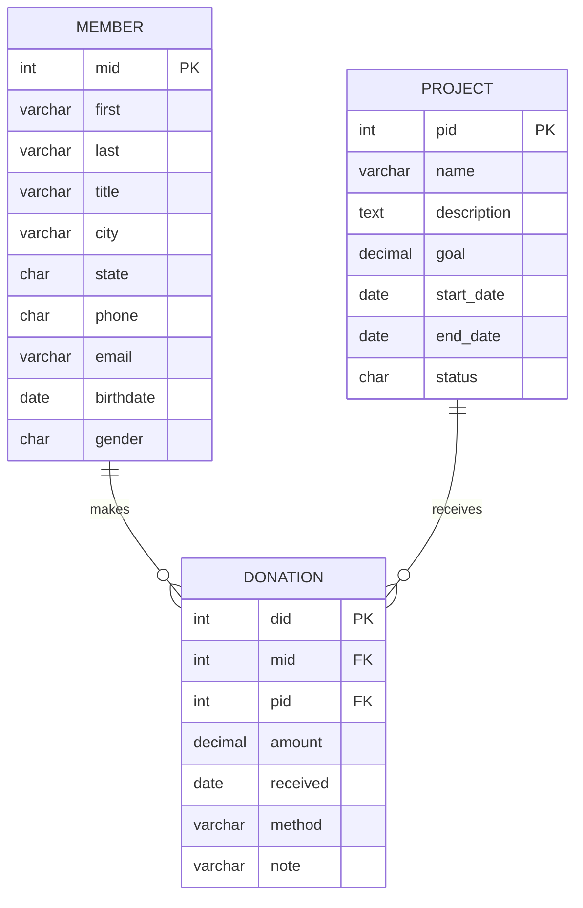

# CS415 Database Sample Project – Fall 2025 - Draft

---

## Database Summary Report

### Project Overview

**Foresters Give** is a small nonprofit that operates out of Huntington University. The group focuses on supporting local service projects, including food drives, campus clean-up days, tutoring events, and community outreach programs. The organization is comprised mostly of HU students, faculty, and alumni who want to give back, either by volunteering or donating money to various campus and community projects.

Each project has its own fundraising goal, purpose, and timeline. Some projects receive a great deal of attention, while others struggle to meet their objectives. Members may choose to donate any amount to any project they care about, and many of them support multiple projects throughout the school year. Currently, Foresters Gives is attempting to manage everything through spreadsheets and emails, which can become messy and lead to errors.

To make things easier and more accurate, **Foresters Give** wants to move to a simple relational database. This database will help keep track of members, projects, and donations in a clear and organized way. It will also allow the group to grow without losing important information or wasting time searching through old files.

### Users View
From a user’s point of view, the database will make everyday tasks much simpler. A staff member or student worker will be able to look up a member’s basic information, view the projects they’ve donated to, and add new donations as they come in. Entering a donation will be as easy as selecting the member, choosing the project, and entering the amount and date.

Project managers will use the database to track the amount of money each project has raised and its proximity to reaching its goal. They can run quick searches to see which projects are doing well and which ones might need more promotion. This will help Foresters Give plan future events and make better decisions about where to focus their efforts.

At the end of the semester or year, the database will facilitate the creation of reports for board meetings or student leadership groups. Reports include information such as total donations, top-giving members, or the most popular projects. Because all the information is stored in one place, the reports will be accurate and easy to generate—something that's hard to do with spreadsheets.

---

## Database ER Model



### Database Design Description

The database for Foresters Give is built around three normalized entities: `member`, `project`, and `donation`. Each table stores a focused set of information. Members represent students, faculty, or alumni who participate in donating; projects represent fundraising goals or service initiatives; donations link the two together. Keeping these entities separate avoids repeating information and makes the structure easier to maintain.

During normalization, one major decision was not to copy member names or project names into the donation table. Instead, the donation table stores only foreign keys (mid, pid) and donation-specific details, such as amount and date. This avoids update anomalies—for example, a member changing their email should update one row, not dozens. All fields in each table depend only on the primary key, meaning the design satisfies 3rd Normal Form.

Another design choice was to include a simple status code in the project table rather than placing statuses into a separate lookup table. Since Foresters Give only requires a few basic statuses (such as planned, active, and closed), keeping the field within the project table is both practical and easy for new database students to understand. If needed in the future, this could be expanded into a separate status table.

`member`
The member table stores the personal and contact information for each person who donates to Foresters Give. It acts as the source of truth for names, email addresses, and demographics. All donations must connect back to a member in this table.

`project`
The project table represents each fundraising project or initiative supported by Foresters Give. It contains the project's name, description, fundraising goal, start and end dates, and current status. It lets staff track what projects exist and how active they are.

`donation`
The donation table records each individual donation made by a member to a project. It stores the amount, date, payment method, and any notes. This table is central to all reporting, since totals and summaries come from aggregating donation rows.

---

### Create Tables 

The following SQL creates the `member`, `project`, and `donation` tables in the current database. Note that it does not create a database, only the tables.

```sql

-- ==========================================
-- MEMBER TABLE
-- Stores people who participate/donate
-- ==========================================
CREATE TABLE member (
    mid       INT            NOT NULL AUTO_INCREMENT,
    first     VARCHAR(20)    NULL,
    last      VARCHAR(25)    NULL,
    title     VARCHAR(10)    NULL,       -- Mr., Ms., Dr., etc.
    city      VARCHAR(25)    NULL,
    state     CHAR(2)        NULL,       -- IN, OH, MI, etc.
    phone     CHAR(10)       NULL,       -- digits only, e.g. 2603594209
    email     VARCHAR(40)    NULL,
    birthdate DATE           NULL,
    gender    CHAR(1)        NULL,       -- M, F, etc.
    PRIMARY KEY (mid)
) ENGINE=InnoDB;

-- ==========================================
-- PROJECT TABLE
-- Stores fundraising projects/initiatives
-- ==========================================
CREATE TABLE project (
    pid         INT            NOT NULL AUTO_INCREMENT,
    name        VARCHAR(40)    NOT NULL,
    description TEXT           NULL,
    goal        DECIMAL(10,2)  NULL,       -- target fundraising goal
    start_date  DATE           NULL,
    end_date    DATE           NULL,
    status      CHAR(1)        NULL,       -- P=planned, A=active, C=closed
    PRIMARY KEY (pid)
) ENGINE=InnoDB;

-- ==========================================
-- DONATION TABLE
-- Links members to projects (who gave what
-- to which project and when)
-- ==========================================
CREATE TABLE donation (
    did       INT            NOT NULL AUTO_INCREMENT,
    mid       INT            NOT NULL,       -- FK to member.mid
    pid       INT            NOT NULL,       -- FK to project.pid
    amount    DECIMAL(10,2)  NOT NULL,
    received  DATE           NOT NULL,
    method    VARCHAR(20)    NULL,           -- cash, card, online, etc.
    note      VARCHAR(100)   NULL,
    PRIMARY KEY (did),
    CONSTRAINT fk_donation_member
        FOREIGN KEY (mid)
        REFERENCES member(mid)
        ON UPDATE RESTRICT
        ON DELETE RESTRICT,
    CONSTRAINT fk_donation_project
        FOREIGN KEY (pid)
        REFERENCES project(pid)
        ON UPDATE RESTRICT
        ON DELETE RESTRICT
) ENGINE=InnoDB;

```

---

### Insert Data

The following SQL inserts sample data for the `member` (x20), `project` (x8), and `donation` (x100) tables in the current database.

```sql

-- Note: make sure you are in the right database
-- USE foresters_give;

-------------------------------------------------------
-- MEMBER SAMPLE DATA (20 rows)
-------------------------------------------------------
INSERT INTO member (mid, first, last, title, city, state, phone, email, birthdate, gender) VALUES
  (1,  'Jeff',    'Lehman',   'Dr.',  'Huntington',       'IN', '2603594209', 'jeff.lehman@hu.edu',         '1970-06-15', 'M'),
  (2,  'Lisa',    'Smith',    'Mrs.', 'Huntington',       'IN', '2605550101', 'lisa.smith@example.com',     '1980-03-22', 'F'),
  (3,  'Mark',    'Wenger',   'Mr.',  'Huntington',       'IN', '2605550102', 'mark.wenger@example.com',    '1975-11-02', 'M'),
  (4,  'Sarah',   'Johnson',  'Ms.',  'Fort Wayne',       'IN', '2605550103', 'sarah.johnson@example.com',  '1999-08-19', 'F'),
  (5,  'Caleb',   'Brown',    'Mr.',  'Roanoke',          'IN', '2605550104', 'caleb.brown@example.com',    '2002-01-05', 'M'),
  (6,  'Hannah',  'Miller',   'Ms.',  'Huntington',       'IN', '2605550105', 'hannah.miller@example.com',  '2001-07-14', 'F'),
  (7,  'David',   'Peters',   'Mr.',  'Warren',           'IN', '2605550106', 'david.peters@example.com',   '1998-02-11', 'M'),
  (8,  'Maria',   'Lopez',    'Ms.',  'Huntington',       'IN', '2605550107', 'maria.lopez@example.com',    '2000-12-09', 'F'),
  (9,  'Ethan',   'Garrett',  'Mr.',  'Andrews',          'IN', '2605550108', 'ethan.garrett@example.com',  '2003-04-30', 'M'),
  (10, 'Olivia',  'Turner',   'Ms.',  'Fort Wayne',       'IN', '2605550109', 'olivia.turner@example.com',  '2004-10-03', 'F'),
  (11, 'Noah',    'Baker',    'Mr.',  'Huntington',       'IN', '2605550110', 'noah.baker@example.com',     '2002-09-15', 'M'),
  (12, 'Emma',    'Clark',    'Ms.',  'Roanoke',          'IN', '2605550111', 'emma.clark@example.com',     '2001-05-27', 'F'),
  (13, 'Jacob',   'Foster',   'Mr.',  'Huntington',       'IN', '2605550112', 'jacob.foster@example.com',   '1999-01-19', 'M'),
  (14, 'Ava',     'Moore',    'Ms.',  'Huntington',       'IN', '2605550113', 'ava.moore@example.com',      '2003-06-08', 'F'),
  (15, 'Logan',   'Hall',     'Mr.',  'Bluffton',         'IN', '2605550114', 'logan.hall@example.com',     '2000-03-11', 'M'),
  (16, 'Mia',     'Adams',    'Ms.',  'Huntington',       'IN', '2605550115', 'mia.adams@example.com',      '2004-09-21', 'F'),
  (17, 'James',   'Wilson',   'Mr.',  'Huntington',       'IN', '2605550116', 'james.wilson@example.com',   '1985-02-28', 'M'),
  (18, 'Chloe',   'Reed',     'Ms.',  'Fort Wayne',       'IN', '2605550117', 'chloe.reed@example.com',     '1997-07-07', 'F'),
  (19, 'Benjamin','Ross',     'Mr.',  'Huntington',       'IN', '2605550118', 'ben.ross@example.com',       '1996-11-23', 'M'),
  (20, 'Natalie', 'Price',    'Ms.',  'North Manchester', 'IN', '2605550119', 'natalie.price@example.com',  '1998-08-12', 'F');

-------------------------------------------------------
-- PROJECT SAMPLE DATA (8 rows)
-------------------------------------------------------
INSERT INTO project (pid, name, description, goal, start_date, end_date, status) VALUES
  (1, 'HU Food Pantry',
     'Stock and distribute food to HU students and local families',
     5000.00, '2025-01-15', '2025-05-01', 'A'),
  (2, 'Campus Creek Clean-Up',
     'Clean and restore the creek area behind campus in Huntington',
     1500.00, '2025-03-01', '2025-04-15', 'P'),
  (3, 'Community Garden',
     'Support supplies and tools for the HU community garden',
     2500.00, '2025-04-01', '2025-09-30', 'P'),
  (4, 'Kids Coding Camp',
     'One-week summer coding camp for local middle-school students',
     3000.00, '2025-06-01', '2025-07-15', 'P'),
  (5, 'Habitat Build Day',
     'Partner day with Habitat for Humanity in Huntington County',
     4000.00, '2025-05-01', '2025-06-30', 'P'),
  (6, 'Forester Scholarship Fund',
     'Small scholarships for local high school students attending HU',
     8000.00, '2025-01-01', '2025-12-31', 'A'),
  (7, 'Youth Tutoring Nights',
     'After-school tutoring at a Huntington community center',
     2000.00, '2025-02-01', '2025-05-31', 'A'),
  (8, 'Community Christmas Outreach',
     'Christmas meal and gift outreach for families in Huntington',
     6000.00, '2025-10-15', '2025-12-31', 'P');

-------------------------------------------------------
-- DONATION SAMPLE DATA (100 rows)
-- NOTE: These are synthetic but “realistic” patterns of giving.
-- mid ranges 1–20, pid ranges 1–8.
-------------------------------------------------------
INSERT INTO donation (did, mid, pid, amount, received, method, note) VALUES
  (1,  1, 1,  25.00, '2025-02-01', 'online', 'chapel offering'),
  (2,  2, 1,  50.00, '2025-02-02', 'card',   'student fundraiser'),
  (3,  3, 1, 100.00, '2025-02-03', 'check',  'matched gift'),
  (4,  4, 2,  20.00, '2025-02-04', 'cash',   'community donor'),
  (5,  5, 2,  40.00, '2025-02-05', 'online', 'chapel offering'),
  (6,  6, 3,  30.00, '2025-02-06', 'card',   ''),
  (7,  7, 3,  75.00, '2025-02-07', 'check',  'student fundraiser'),
  (8,  8, 4, 150.00, '2025-02-08', 'online', 'matched gift'),
  (9,  9, 4,  25.00, '2025-02-09', 'cash',   ''),
  (10, 10, 5,  50.00, '2025-02-10', 'card',  'community donor'),

  (11, 11, 5,  20.00, '2025-02-11', 'online', 'chapel offering'),
  (12, 12, 6, 200.00, '2025-02-12', 'check',  'alumni gift'),
  (13, 13, 6,  25.00, '2025-02-13', 'card',   ''),
  (14, 14, 7,  40.00, '2025-02-14', 'cash',   'student fundraiser'),
  (15, 15, 7,  75.00, '2025-02-15', 'online', 'matched gift'),
  (16, 16, 8, 100.00, '2025-02-16', 'card',   ''),
  (17, 17, 8,  50.00, '2025-02-17', 'check',  'community donor'),
  (18, 18, 1,  20.00, '2025-02-18', 'cash',   'chapel offering'),
  (19, 19, 1,  25.00, '2025-02-19', 'online', ''),
  (20, 20, 2,  30.00, '2025-02-20', 'card',   'student fundraiser'),

  (21, 1,  2,  50.00, '2025-02-21', 'check',  'matched gift'),
  (22, 2,  3,  25.00, '2025-02-22', 'online', 'community donor'),
  (23, 3,  3,  40.00, '2025-02-23', 'card',   ''),
  (24, 4,  4,  60.00, '2025-02-24', 'cash',   'chapel offering'),
  (25, 5,  4, 100.00, '2025-02-25', 'online', 'alumni gift'),
  (26, 6,  5,  15.00, '2025-02-26', 'card',   'student fundraiser'),
  (27, 7,  5,  50.00, '2025-02-27', 'online', ''),
  (28, 8,  6,  75.00, '2025-02-28', 'check',  'matched gift'),
  (29, 9,  6, 150.00, '2025-03-01', 'cash',   'community donor'),
  (30, 10, 7,  20.00, '2025-03-02', 'online', 'chapel offering'),

  (31, 11, 7,  30.00, '2025-03-03', 'card',   ''),
  (32, 12, 8,  60.00, '2025-03-04', 'check',  'student fundraiser'),
  (33, 13, 8,  80.00, '2025-03-05', 'online', 'matched gift'),
  (34, 14, 1,  25.00, '2025-03-06', 'cash',   ''),
  (35, 15, 1,  50.00, '2025-03-07', 'card',   'community donor'),
  (36, 16, 2, 100.00, '2025-03-08', 'online', 'chapel offering'),
  (37, 17, 2,  20.00, '2025-03-09', 'check',  ''),
  (38, 18, 3,  25.00, '2025-03-10', 'online', 'student fundraiser'),
  (39, 19, 3,  40.00, '2025-03-11', 'cash',   'matched gift'),
  (40, 20, 4,  75.00, '2025-03-12', 'card',   ''),

  (41, 1,  4, 150.00, '2025-03-13', 'online', 'alumni gift'),
  (42, 2,  5,  20.00, '2025-03-14', 'cash',   ''),
  (43, 3,  5,  35.00, '2025-03-15', 'card',   'community donor'),
  (44, 4,  6,  60.00, '2025-03-16', 'online', 'chapel offering'),
  (45, 5,  6,  90.00, '2025-03-17', 'check',  ''),
  (46, 6,  7,  25.00, '2025-03-18', 'card',   'student fundraiser'),
  (47, 7,  7,  50.00, '2025-03-19', 'online', 'matched gift'),
  (48, 8,  8,  65.00, '2025-03-20', 'cash',   ''),
  (49, 9,  8, 100.00, '2025-03-21', 'online', 'community donor'),
  (50, 10, 1,  30.00, '2025-03-22', 'card',   'chapel offering'),

  (51, 11, 1,  25.00, '2025-03-23', 'online', ''),
  (52, 12, 2,  45.00, '2025-03-24', 'cash',   'student fundraiser'),
  (53, 13, 2,  70.00, '2025-03-25', 'card',   'matched gift'),
  (54, 14, 3,  20.00, '2025-03-26', 'online', 'community donor'),
  (55, 15, 3,  50.00, '2025-03-27', 'check',  ''),
  (56, 16, 4,  80.00, '2025-03-28', 'online', 'chapel offering'),
  (57, 17, 4,  25.00, '2025-03-29', 'cash',   'student fundraiser'),
  (58, 18, 5,  40.00, '2025-03-30', 'card',   ''),
  (59, 19, 5,  60.00, '2025-03-31', 'check',  'community donor'),
  (60, 20, 6,  90.00, '2025-04-01', 'online', 'alumni gift'),

  (61, 1,  6,  20.00, '2025-04-02', 'card',   ''),
  (62, 2,  7,  35.00, '2025-04-03', 'online', 'chapel offering'),
  (63, 3,  7,  55.00, '2025-04-04', 'cash',   'student fundraiser'),
  (64, 4,  8,  70.00, '2025-04-05', 'online', 'matched gift'),
  (65, 5,  8, 100.00, '2025-04-06', 'check',  ''),
  (66, 6,  1,  25.00, '2025-04-07', 'cash',   'community donor'),
  (67, 7,  1,  40.00, '2025-04-08', 'online', 'chapel offering'),
  (68, 8,  2,  60.00, '2025-04-09', 'card',   ''),
  (69, 9,  2, 100.00, '2025-04-10', 'online', 'student fundraiser'),
  (70, 10, 3,  20.00, '2025-04-11', 'cash',   'matched gift'),

  (71, 11, 3,  35.00, '2025-04-12', 'card',   ''),
  (72, 12, 4,  50.00, '2025-04-13', 'online', 'community donor'),
  (73, 13, 4,  75.00, '2025-04-14', 'check',  'alumni gift'),
  (74, 14, 5,  25.00, '2025-04-15', 'cash',   ''),
  (75, 15, 5,  45.00, '2025-04-16', 'online', 'chapel offering'),
  (76, 16, 6,  65.00, '2025-04-17', 'card',   ''),
  (77, 17, 6, 100.00, '2025-04-18', 'online', 'student fundraiser'),
  (78, 18, 7,  20.00, '2025-04-19', 'cash',   'matched gift'),
  (79, 19, 7,  30.00, '2025-04-20', 'online', ''),
  (80, 20, 8,  55.00, '2025-04-21', 'check',  'community donor'),

  (81, 1,  8,  75.00, '2025-04-22', 'online', 'alumni gift'),
  (82, 2,  1,  25.00, '2025-04-23', 'cash',   ''),
  (83, 3,  1,  40.00, '2025-04-24', 'card',   'student fundraiser'),
  (84, 4,  2,  60.00, '2025-04-25', 'online', 'matched gift'),
  (85, 5,  2,  80.00, '2025-04-26', 'check',  ''),
  (86, 6,  3,  20.00, '2025-04-27', 'cash',   'chapel offering'),
  (87, 7,  3,  45.00, '2025-04-28', 'online', 'community donor'),
  (88, 8,  4,  65.00, '2025-04-29', 'card',   ''),
  (89, 9,  4,  90.00, '2025-04-30', 'online', 'student fundraiser'),
  (90, 10, 5,  30.00, '2025-05-01', 'cash',   'matched gift'),

  (91, 11, 5,  50.00, '2025-05-02', 'online', ''),
  (92, 12, 6,  70.00, '2025-05-03', 'card',   'community donor'),
  (93, 13, 6, 100.00, '2025-05-04', 'online', 'alumni gift'),
  (94, 14, 7,  25.00, '2025-05-05', 'cash',   ''),
  (95, 15, 7,  45.00, '2025-05-06', 'online', 'chapel offering'),
  (96, 16, 8,  65.00, '2025-05-07', 'card',   ''),
  (97, 17, 8,  90.00, '2025-05-08', 'online', 'student fundraiser'),
  (98, 18, 1,  20.00, '2025-05-09', 'cash',   'matched gift'),
  (99, 19, 1,  35.00, '2025-05-10', 'online', ''),
  (100,20, 2,  60.00, '2025-05-11', 'check',  'community donor');
```

---

### Queries (60 points)

Create ten SQL code blocks that demonstrate the following queries. For each query, include a **2–3 sentence description** before 
the SQL code block explaining its purpose and when/why it would be used.  Clear label each Query ie. Query 1, Query 2, etc...  
Show the results of your queries in table format.  Abbreviate the output for large results.

1. `SELECT` using **ORDER BY** two or more columns.

   Show all students sorted by their last name ...
```sql

select * from student order by name desc;

```

2. `SELECT` using a **calculated field** with a meaningful column heading.
   * Example: `lengthseconds / 60 AS minutes` (not an aggregation).
  
   Show loan length as hours ...
         
```sql

select * from days * 24 as hours from loan;

```
  
3. 
4. `SELECT` using a **MariaDB function** (e.g., `MID`, `MONTH`, `DATE`) (not an aggregation).
5. `SELECT` with an **aggregation** (`COUNT`, `SUM`, `MIN`, `AVG`) plus `GROUP BY` and `HAVING`.
6. `Join` of **three or more tables** (INNER JOIN or cross-product).
7. Left or Right `JOIN` (left, or right join).

8. 9. `UPDATE` query.
10. `DELETE` query.
11. Create a `View` and demonstrate using this view.
12. Create a `Transaction` with either `ROLLBACK` or `COMMIT` and demonstrate this transaction.

---

### Reports (20 points) 

Connect to an external reporting tool (or export your data) and create two reports.

1. Chart or Graph-based report
2. Table-based report with Report Title

Use Excel, Access, PowerBI, or any other reporting tool.  Post your report and include a link to each report as a .pdf (or viewable image). 
In one or two paragraphs, describe the reporting software you used and the purpose of each report.

---

### Delete Tables (10 points)

Create a single SQL code block to delete your tables and data.

* Script to delete **all data, tables, and views**.

```sql

-- prj4.sql
-- j.l.lehman
-- sample drop table statements for CS415 database project
-- deletes database tables from exam #3

-- note: must delete tables with foreign keys first
--       to ensure referential integrity

-- drop tables
drop table loan;
drop table camera;
drop table camera_type;
drop table student;
---
```

---

### Poster and Presentation (20 points)

(15 points) Create a poster describing your Database Project using the template provided.  Host poster as .PDF on GitHub, include link to file in your documentation.

[Poster PDF](poster.pdf)


(5 points) Deliver a five-minute presentation during finals that describes your database design, demonstrates your SQL queries, 
and describing any challenges you encountered and insights you gained from the project.


---
  -- end --
  

---
