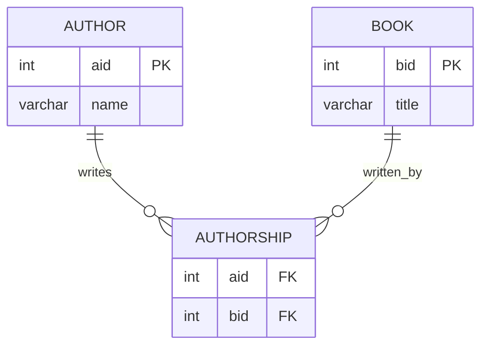

Perfect — here’s the same set of **student-facing questions**, now with the **result tables included**. Students will need to write the SQL that produces these outputs.

---

### Author / Authorship Practice Questions

1. **Cross Product Basics**

   * How many rows result when you take the cross product of the `author` and `authorship` tables?
   * How many rows result when you take the cross product of the `author`, and `authorship` '`and book` tables?

   **Result:**


---

2. **Joining Two Tables**

   * Show each author’s ID, name, and the book IDs from the `authorship` table that match.
   * How do we avoid listing the author ID twice in the output?
   * Redo the query using table aliases.

   **Result:**

   ```
   +-----+-------+------+
   | aid | name  | bid  |
   +-----+-------+------+
   |   1 | Alice |    4 |
   |   3 | Carol |    1 |
   |   5 | Erin  |    1 |
   |   4 | Dan   |    5 |
   |   4 | Dan   |    2 |
   |   5 | Erin  |    6 |
   +-----+-------+------+
   ```

---

3. **INNER JOIN vs. CROSS PRODUCT**

   * Write a join between `author` and `authorship` using the `JOIN ON` syntax.
   * How do the results compare to the cross product with a `WHERE` condition?

   **Result:** (same as above)

   ```
   +-----+-------+------+
   | aid | name  | bid  |
   +-----+-------+------+
   |   1 | Alice |    4 |
   |   3 | Carol |    1 |
   |   5 | Erin  |    1 |
   |   4 | Dan   |    5 |
   |   4 | Dan   |    2 |
   |   5 | Erin  |    6 |
   +-----+-------+------+
   ```

---

4. **LEFT JOIN**

   * List all authors, showing book IDs if available.
   * Which author(s) appear with `NULL` values in the result? Why?

   **Result:**

   ```
   +-----+-------+------+
   | aid | name  | bid  |
   +-----+-------+------+
   |   1 | Alice |    4 |
   |   3 | Carol |    1 |
   |   5 | Erin  |    1 |
   |   4 | Dan   |    5 |
   |   4 | Dan   |    2 |
   |   5 | Erin  |    6 |
   |   2 | Bob   | NULL |
   +-----+-------+------+
   ```

---

5. **RIGHT JOIN**

   * List all rows from the `authorship` table, showing author names if available.
   * Which authorship record(s) show `NULL` for the author? Why?

   **Result:**

   ```
   +------+-------+------+
   | aid  | name  | bid  |
   +------+-------+------+
   |    1 | Alice |    4 |
   |    3 | Carol |    1 |
   | NULL | NULL  |    5 |
   |    5 | Erin  |    1 |
   |    4 | Dan   |    5 |
   |    4 | Dan   |    2 |
   |    5 | Erin  |    6 |
   +------+-------+------+
   ```

---

6. **FULL OUTER JOIN**

   * Combine results of a left join and right join to show all data.
   * Which rows only appear in one of the two tables?

   **Result:**

   ```
   +------+-------+------+
   | aid  | name  | bid  |
   +------+-------+------+
   |    1 | Alice |    4 |
   |    3 | Carol |    1 |
   |    5 | Erin  |    1 |
   |    4 | Dan   |    5 |
   |    4 | Dan   |    2 |
   |    5 | Erin  |    6 |
   |    2 | Bob   | NULL |
   | NULL | NULL  |    5 |
   +------+-------+------+
   ```

---

7. **Three-Table Join**

   * Join `author`, `authorship`, and `book` to display each author’s name alongside the book titles they are associated with.
   * What happens to Bob (author 2) when included in this join?

   **Result:**

   ```
   +-----+-------+------+----------------------------+
   | aid | name  | bid  | title                      |
   +-----+-------+------+----------------------------+
   |   1 | Alice |    4 | Delilicious Donuts         |
   |   3 | Carol |    1 | Awful Ants Are Around      |
   |   5 | Erin  |    1 | Awful Ants Are Around      |
   |   4 | Dan   |    5 | Easy Excellent Eggs        |
   |   4 | Dan   |    2 | Beautiful Barns            |
   |   5 | Erin  |    6 | NULL (invalid reference)   |
   +-----+-------+------+----------------------------+
   ```

---

8. **Filtered Three-Table Join**

   * Show all book titles written by **Dan**, ordered by title.

   **Result:**

   ```
   +-----+-------+------+---------------------+
   | aid | name  | bid  | title               |
   +-----+-------+------+---------------------+
   |   4 | Dan   |    2 | Beautiful Barns     |
   |   4 | Dan   |    5 | Easy Excellent Eggs |
   +-----+-------+------+---------------------+
   ```

---

9. **Aggregations**

   * List each author ID and the number of books they have authored.
   * Which authors appear to have invalid or extra references?

   **Result:**

   ```
   +------+------------+
   | aid  | count(bid) |
   +------+------------+
   |    1 |          1 |
   |    3 |          1 |
   |    4 |          2 |
   |    5 |          2 |
   |    6 |          1 |
   +------+------------+
   ```

---

10. **Aggregation with HAVING**

    * List only the authors who have written more than one book.

    **Result:**

    ```
    +------+------------+
    | aid  | count(bid) |
    +------+------------+
    |    4 |          2 |
    |    5 |          2 |
    +------+------------+
    ```

---

11. **Aggregation with Join**

    * Show each author’s ID, name, and count of authored books, but include only those who have authored two or more.

    **Result:**

    ```
    +-----+------+-----------------------+
    | aid | name | count(authorship.bid) |
    +-----+------+-----------------------+
    |   4 | Dan  |                     2 |
    |   5 | Erin |                     2 |
    +-----+------+-----------------------+
    ```

---
