# Database: facultystudentjoins

## ER Model

```mermaid
erDiagram
    FACULTY {
      fid VARCHAR(2) PK
      name VARCHAR(20)
    }

    STUDENT {
      id VARCHAR(2) PK
      name VARCHAR(20)
      fid VARCHAR(2) FK
    }

    %% Conceptual M:N relationship shown directly between the two entities
    FACULTY }o--o{ STUDENT : "advises ⇄ enrolled"
```

## data

**faculty table**
| id | name       |
|----|------------|
| f1 | mcgonagall |
| f2 | snape      |
| f3 | hagrid     |
| f4 | flitwick   |
| f5 | binns      |

**student table**
| id | name     | fid |
|----|----------|-----|
| s1 | potter   | f3  |
| s2 | granger  | f1  |
| s3 | weasley  | f1  |
| s4 | malfoy   | f2  |
| s5 | crabbe   | f6  |
| s6 | goyle    | f2  |
| s7 | finnigan | f9  |
| s8 | wood     | f7  |
| s9 | thomas   | f1  |

---

## SQL to create database
Using your own database (ie. lastname), create the faculty and student tables by copying and pasting the following `create` and `insert` statements.

### faculty table
```sql

-- create table
CREATE TABLE `faculty` (
  `id` varchar(2) NOT NULL,
  `name` varchar(20) NOT NULL
) ENGINE=InnoDB DEFAULT CHARSET=latin1;

-- insert data
INSERT INTO `faculty` VALUES ('f1','mcgonagall'),('f2','snape'),('f3','hagrid'),('f4','flitwick'),('f5','binns');
```

### student table
```sql

-- create table
CREATE TABLE `student` (
  `id` varchar(2) NOT NULL,
  `name` varchar(20) NOT NULL,
  `fid` varchar(2) NOT NULL
) ENGINE=InnoDB DEFAULT CHARSET=latin1;

-- insert data
INSERT INTO `student` VALUES ('s1','potter','f3'),('s2','granger','f1'),('s3','weasley','f1'),('s4','malfoy','f2'),('s5','crabbe','f6'),('s6','goyle','f2'),('s7','finnigan','f9'),('s8','wood','f7'),('s9','thomas','f1');
```

