# Database: facultystudentjoins

## ER Model

```mermaid
erDiagram
    FACULTY {
      fid VARCHAR(2) PK
      name VARCHAR(20)
    }

    STUDENT {
      id VARCHAR(2) PK
      name VARCHAR(20)
      fid VARCHAR(2) FK
    }

    %% Conceptual M:N relationship shown directly between the two entities
    FACULTY }o--o{ STUDENT : "advises ⇄ enrolled"
```

## data

**faculty table**
| id | name       |
|----|------------|
| f1 | mcgonagall |
| f2 | snape      |
| f3 | hagrid     |
| f4 | flitwick   |
| f5 | binns      |

**student table**
| id | name     | fid |
|----|----------|-----|
| s1 | potter   | f3  |
| s2 | granger  | f1  |
| s3 | weasley  | f1  |
| s4 | malfoy   | f2  |
| s5 | crabbe   | f6  |
| s6 | goyle    | f2  |
| s7 | finnigan | f9  |
| s8 | wood     | f7  |
| s9 | thomas   | f1  |

---

## SQL to create database
Using your own database (ie. lastname), create the faculty and student tables by copying and pasting the following `create` and `insert` statements.

### faculty table
```sql

-- create table
CREATE TABLE `faculty` (
  `id` varchar(2) NOT NULL,
  `name` varchar(20) NOT NULL
) ENGINE=InnoDB DEFAULT CHARSET=latin1;

-- insert data
INSERT INTO `faculty` VALUES ('f1','mcgonagall'),('f2','snape'),('f3','hagrid'),('f4','flitwick'),('f5','binns');
```

### student table
```sql

-- create table
CREATE TABLE `student` (
  `id` varchar(2) NOT NULL,
  `name` varchar(20) NOT NULL,
  `fid` varchar(2) NOT NULL
) ENGINE=InnoDB DEFAULT CHARSET=latin1;

-- insert data
INSERT INTO `student` VALUES ('s1','potter','f3'),('s2','granger','f1'),('s3','weasley','f1'),('s4','malfoy','f2'),('s5','crabbe','f6'),('s6','goyle','f2'),('s7','finnigan','f9'),('s8','wood','f7'),('s9','thomas','f1');
```

--- 

## Joins

### Cartesian Product (cross join)
Match every row with every row. Result will be row_count_table1 x row_count_table2. In this example 5 x 9 = 45 rows. 
```sql
select student.id, student.name, faculty.id, faculty.name

from student, faculty;
```
**result**
| id | name     | id | name       |
|----|----------|----|------------|
| s1 | potter   | f1 | mcgonagall |
| s1 | potter   | f2 | snape      |
| s1 | potter   | f3 | hagrid     |
| s1 | potter   | f4 | flitwick   |
| s1 | potter   | f5 | binns      |
| s2 | granger  | f1 | mcgonagall |
| s2 | granger  | f2 | snape      |
| s2 | granger  | f3 | hagrid     |
| s2 | granger  | f4 | flitwick   |
| s2 | granger  | f5 | binns      |
| s3 | weasley  | f1 | mcgonagall |
| s3 | weasley  | f2 | snape      |
| s3 | weasley  | f3 | hagrid     |
| s3 | weasley  | f4 | flitwick   |
| s3 | weasley  | f5 | binns      |
| s4 | malfoy   | f1 | mcgonagall |
| s4 | malfoy   | f2 | snape      |
| s4 | malfoy   | f3 | hagrid     |
| s4 | malfoy   | f4 | flitwick   |
| s4 | malfoy   | f5 | binns      |
| s5 | crabbe   | f1 | mcgonagall |
| s5 | crabbe   | f2 | snape      |
| s5 | crabbe   | f3 | hagrid     |
| s5 | crabbe   | f4 | flitwick   |
| s5 | crabbe   | f5 | binns      |
| s6 | goyle    | f1 | mcgonagall |
| s6 | goyle    | f2 | snape      |
| s6 | goyle    | f3 | hagrid     |
| s6 | goyle    | f4 | flitwick   |
| s6 | goyle    | f5 | binns      |
| s7 | finnigan | f1 | mcgonagall |
| s7 | finnigan | f2 | snape      |
| s7 | finnigan | f3 | hagrid     |
| s7 | finnigan | f4 | flitwick   |
| s7 | finnigan | f5 | binns      |
| s8 | wood     | f1 | mcgonagall |
| s8 | wood     | f2 | snape      |
| s8 | wood     | f3 | hagrid     |
| s8 | wood     | f4 | flitwick   |
| s8 | wood     | f5 | binns      |
| s9 | thomas   | f1 | mcgonagall |
| s9 | thomas   | f2 | snape      |
| s9 | thomas   | f3 | hagrid     |
| s9 | thomas   | f4 | flitwick   |
| s9 | thomas   | f5 | binns      |

--- 

### Equi Join (using WHERE)

```sql
select student.id, student.name,
       faculty.id, faculty.name

from student, faculty

where student.fid = faculty.id;
```

### Equi Join (using WHERE) with Table Alias

```sql
select s.id, s.name, f.id, f.name

from student s, faculty f

where s.fid = f.id;
```

**Result: (Both Approaches)**

| id | name    | id | name       |
|----|---------|----|------------|
| s1 | potter  | f3 | hagrid     |
| s2 | granger | f1 | mcgonagall |
| s3 | weasley | f1 | mcgonagall |
| s4 | malfoy  | f2 | snape      |
| s6 | goyle   | f2 | snape      |
| s9 | thomas  | f1 | mcgonagall |


---

## Inner Join

### Using 'inner join' keyword.

```sql
select student.id, student.name, faculty.id, faculty.name

from student inner join faculty on student.fid = faculty.id;
```

### Using 'join' keyword.

```sql
select student.id, student.name, faculty.id, faculty.name

from student join faculty on student.fid = faculty.id;
```

### Using table alias.

```sql
select s.id, s.name, f.id, f.name
from student s inner join faculty f
on s.fid = f.id;
```


**Result:**
| id | name    | id | name       |
|----|---------|----|------------|
| s1 | potter  | f3 | hagrid     |
| s2 | granger | f1 | mcgonagall |
| s3 | weasley | f1 | mcgonagall |
| s4 | malfoy  | f2 | snape      |
| s6 | goyle   | f2 | snape      |
| s9 | thomas  | f1 | mcgonagall |

---

## Left Outer Join

### `student` left join `faculty`
```sql
select student.id, student.name, faculty.id, faculty.name

from student left join faculty on student.fid = faculty.id;
```
**Result:**
| id | name     | id   | name       |
|----|----------|------|------------|
| s2 | granger  | f1   | mcgonagall |
| s3 | weasley  | f1   | mcgonagall |
| s9 | thomas   | f1   | mcgonagall |
| s4 | malfoy   | f2   | snape      |
| s6 | goyle    | f2   | snape      |
| s1 | potter   | f3   | hagrid     |
| s5 | crabbe   | NULL | NULL       |
| s7 | finnigan | NULL | NULL       |
| s8 | wood     | NULL | NULL       |


### `faculty` left join `student`
```sql
select student.id, student.name, faculty.id, faculty.name

from faculty left join student on student.fid = faculty.id;
```

**Result:**
| id   | name    | id | name       |
|------|---------|----|------------|
| s1   | potter  | f3 | hagrid     |
| s2   | granger | f1 | mcgonagall |
| s3   | weasley | f1 | mcgonagall |
| s4   | malfoy  | f2 | snape      |
| s6   | goyle   | f2 | snape      |
| s9   | thomas  | f1 | mcgonagall |
| NULL | NULL    | f4 | flitwick   |
| NULL | NULL    | f5 | binns      |


---

## Right Outer Join

```sql
select student.id, student.name,
       faculty.id, faculty.name
from student right join faculty on
     student.fid = faculty.id;
```

```sql
select student.id, student.name,
       faculty.id, faculty.name
from faculty right join student on
     student.fid = faculty.id;
```

**Result:**

<!-- paste results here -->

---

## Full Outer Join (emulated with UNION)

```sql
select student.id, student.name,
       faculty.id, faculty.name
from student left join faculty on
     student.fid = faculty.id
union
select student.id, student.name,
       faculty.id, faculty.name
from student right join faculty on
     student.fid = faculty.id;
```

**Result:**

<!-- paste results here -->

---

## What Faculty Do Not Have Students?

```sql
select faculty.id as "Faculty",
       faculty.name
from faculty left join student on
     student.fid = faculty.id
where student.id is NULL;
```

**Result:**

<!-- paste results here -->

---

## What Faculty Do Have Students?

```sql
select distinct faculty.id as "Faculty",
       faculty.name
from faculty left join student on
     student.fid = faculty.id
where student.id is NOT NULL
order by faculty.id;
```

**Result:**

<!-- paste results here -->

-- end --
